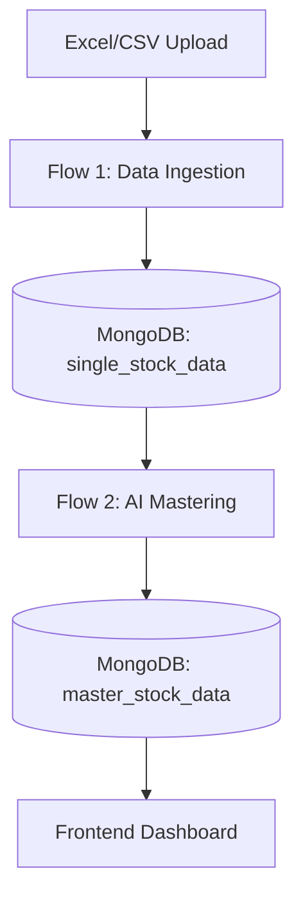
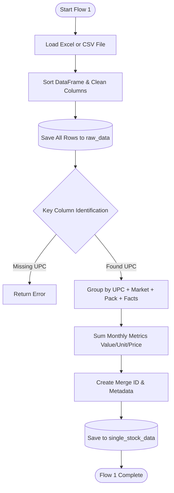
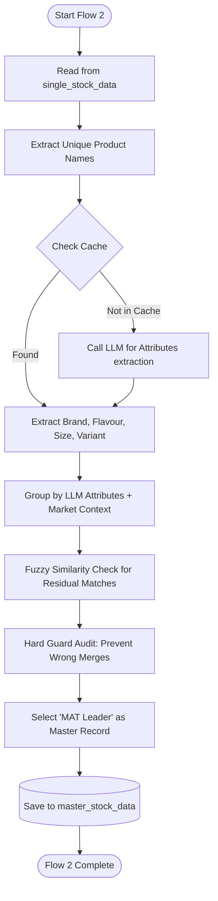

# Backend Data Processing Flow

This document explains the two-stage processing pipeline implemented in `backend/processor.py`.

## Overview
The system processes raw FMCG data through two distinct flows to ensure data consistency and accuracy.

---

## Flow 1: Data Ingestion & Initial Normalization
**Goal**: Transform raw Excel/CSV rows into organized, grouped records.

### Key Steps in Flow 1:
1.  **Column Mapping**: Identifies critical columns like `UPC`, `MARKETS`, `MPACK`, and `FACTS`.
2.  **Raw Backup**: Every row from the uploaded file is backed up in the `raw_data` collection.
3.  **Strict Grouping**: Data is grouped by exact matches of UPC and core attributes.
4.  **Metric Aggregation**: Sales values and units are summed for all variants matching the grouping criteria.

---

## Flow 2: AI-Powered Mastering & Clustering
**Goal**: Use LLM to standardize product names and merge similar variants (e.g., resolving typos).

### Key Steps in Flow 2:
1.  **Attribute Extraction**: The LLM analyzes item names (e.g., `MUNCHYS OATKRUNCH S/BERRY 390G`) and extracts:
    *   **Brand**: `MUNCHYS`
    *   **Product Line**: `OAT KRUNCH`
    *   **Flavour**: `STRAWBERRY`
    *   **Size**: `390G`
2.  **Hierarchical Grouping**: Items are grouped using standardized LLM attributes rather than raw text.
3.  **Fuzzy Matching**: Re-examines items with low AI confidence to find typo-based matches (Similarity > 0.85).
4.  **Hard Guard Audit**: Prevents merging conflicting flavours (e.g., `HAZELNUT` vs `DARK CHOCO`).
5.  **MAT Leader Logic**: In a merged group, the record with the highest "MAT" (Moving Annual Total) sales value becomes the "Master" name.

---

## Technical Features
- **Concurrency**: Uses `ThreadPoolExecutor` for parallel LLM calls (10 workers).
- **Persistent Caching**: Stores LLM results in `LLM_CACHE_STORAGE` to avoid redundant API costs.
- **Fail-safe Rules**: Manual regex-based guards act as a fallback if the AI output is generic.
