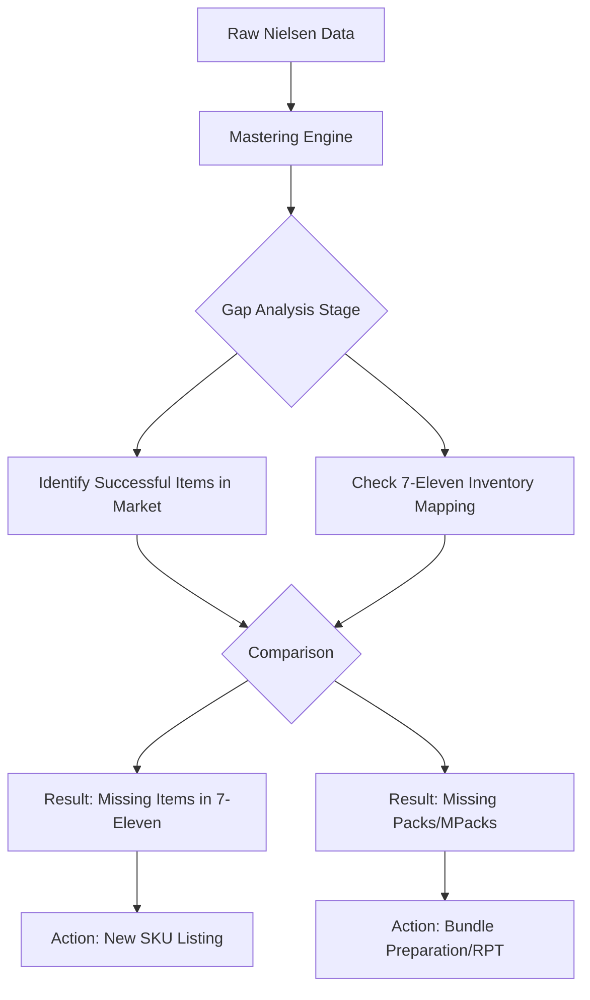

# Business Strategy & Development: Competitive Gap Analysis
**Project Goal**: Identifying market opportunities for 7-Eleven (Malaysia) by analyzing product portfolio gaps against Nielsen market data.

---

## 1. Primary Objective (The Challenge)
Currently, 7-Eleven's biscuit sales are lower compared to the overall Pen Malaysia market. The core hypothesis is that competitors are succeeding due to **Product Formatting (Packaging)** and **Assortment Gaps**.

**The Target**: Identify what "They" (Competitors/Market) have that "We" (7-Eleven) do not have, specifically focusing on Multi-Pack (MPack) variants.

---

## 2. Competitive Analysis Strategy

### A. The "MPack" Advantage
Even if the `ITEM` (UPC) is the same, the **Packaging Strategy** makes the difference:
*   **7-Eleven Strategy**: Selling single packs (e.g., `X1`).
*   **Market Success**: Selling bundle packs (e.g., `X12`).
*   **Action**: Identify single-to-bundle conversion opportunities to match market trends.

### B. Assortment Gap Identification
Detecting items that are performing exceptionally well in the general market but are missing from 7-Eleven's POS records.

---

## 3. Development Workflow (The Process)

---

## 4. Key Metrics for Decision Making

1.  **Sales Velocity (MAT Nov'24)**: Identify which competitor items have the highest sales value in other markets.
2.  **Product Form Comparison**: Match by `Brand`, `Flavour`, and `Size` to see if we offer the same taste but in a different packaging format.
3.  **UPC Mapping**: Tracking if the exact same barcode is sold differently in different markets.

---

## 5. Final Output (Decision Support)
The final report generated by the system will highlight:
*   **Top 10 High-Performing Items (Market)**: Not currently in 7-Eleven.
*   **Packaging Mismatches**: Items where the market prefers `X12` bundles while 7-Eleven only stocks `X1`.
*   **Competitor Pricing Benchmark**: Understanding the price-per-unit advantage of bulk packaging.

---
> [!IMPORTANT]
> This document serves as the high-level roadmap for the development team to build the "Opportunity Finder" logic within the dashboard.
