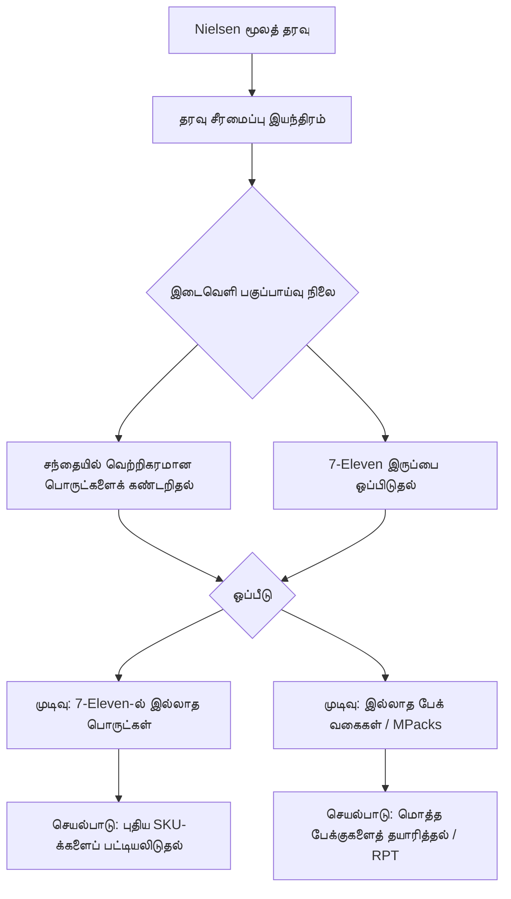

# வணிக உத்தி மற்றும் மேம்பாடு: போட்டி இடைவெளி பகுப்பாய்வு (Competitive Gap Analysis)

**திட்டத்தின் நோக்கம்**: Nielsen சந்தை தரவுகளுடன் (Nielsen Market Data) நமது தயாரிப்புகளை ஒப்பிட்டு, 7-Eleven (மலேசியா)-விற்கான புதிய சந்தை வாய்ப்புகளைக் கண்டறிதல்.

---

## 1. முதன்மை நோக்கம் (சவால்)
தற்போது, மலேசியாவின் பொதுவான சந்தையுடன் ('Pen Malaysia' Market) ஒப்பிடும்போது 7-Eleven-ன் பிஸ்கட் விற்பனை குறைவாக உள்ளது. இதற்கு முக்கிய காரணம் **தயாரிப்பு வடிவம் (Product Packaging)** மற்றும் **தயாரிப்பு வரிசை (Assortment Gaps)** ஆகியவையாக இருக்கலாம் என்பது எங்களது கணிப்பு.

**இலக்கு**: சந்தையில் வெற்றிகரமாக இருக்கும் ஆனால் 7-Eleven-ல் இல்லாத தயாரிப்புகளை, குறிப்பாக மல்டி-பேக் (Multi-Pack/MPack) வகைகளைக் கண்டறிவது.

---

## 2. போட்டி பகுப்பாய்வு உத்தி

### A. "MPack" -ன் நன்மைகள்
ஒரு தயாரிப்பின் பார்கோடு (UPC) ஒன்றாக இருந்தாலும், அதன் **பேக்கேஜிங் உத்தி (Packaging Strategy)** விற்பனையில் பெரிய மாற்றத்தை ஏற்படுத்துகிறது:
*   **7-Eleven உத்தி**: ஒற்றை பாக்கெட்டுகளை விற்பது (உதாரணமாக: `X1`).
*   **சந்தை வெற்றி**: மொத்தமாக பேக் செய்து விற்பது (உதாரணமாக: `X12`).
*   **செயல்பாடு**: சந்தை ட்ரெண்டிற்கு ஏற்ப ஒற்றை பாக்கெட்டுகளை மொத்த பேக்குகளாக (Bundles) மாற்றும் வாய்ப்புகளைக் கண்டறிதல்.

### B. தயாரிப்பு வரிசை இடைவெளியைக் கண்டறிதல்
பொதுவான சந்தையில் மிகச் சிறப்பாக விற்பனையாகும், ஆனால் 7-Eleven-ல் இன்னும் விற்கப்படாத பொருட்களைக் கண்டறிதல்.

---

## 3. மேம்பாட்டு பணிப்பாய்வு (செயல்முறை)

---

## 4. முடிவெடுப்பதற்கான முக்கிய காரணிகள்

1.  **விற்பனை வேகம் (Sales Velocity - MAT Nov'24)**: சந்தையில் உள்ள மற்ற பிராண்டுகளில் எவை அதிக விற்பனை மதிப்பை (Sales Value) கொண்டுள்ளன என்பதைய் கண்டறிதல்.
2.  **தயாரிப்பு ஒப்பீடு**: பிராண்ட் (Brand), சுவை (Flavour) மற்றும் அளவு (Size) கொண்டு நாம் அதே போன்ற தயாரிப்புகளை வேறு வடிவில் விற்கிறோமா எனப் பார்த்தல்.
3.  **பார்கோடு (UPC) மேப்பிங்**: ஒரே பார்கோடு கொண்ட பொருள் வெவ்வேறு சந்தைகளில் வெவ்வேறு வடிவில் விற்பனையாகிறதா என ஆராய்தல்.

---

## 5. இறுதி முடிவு (முடிவெடுக்க உதவும் தகவல்கள்)
இந்த சிஸ்டம் உருவாக்கும் அறிக்கையில் கீழ்க்கண்ட முக்கிய தகவல்கள் இருக்கும்:
*   **சந்தையில் சிறப்பாக விற்பனையாகும் முதல் 10 பொருட்கள்**: தற்போது 7-Eleven-ல் இல்லாதவை.
*   **பேக்கேஜிங் முரண்பாடுகள்**: சந்தையில் `X12` பேக்குகள் விரும்பப்படும் நிலையில், 7-Eleven-ல் `X1` மட்டுமே இருக்கும் பொருட்கள்.
*   **போட்டி விலை ஒப்பீடு**: மொத்த பேக்கேஜிங் மூலம் கிடைக்கும் விலை நன்மைகளைப் புரிந்துகொள்ளுதல்.

---
> [!IMPORTANT]
> இந்த ஆவணம், சிஸ்டத்தை உருவாக்குபவர்களுக்கு ஒரு வழிகாட்டியாக (Roadmap) செயல்படும்.
