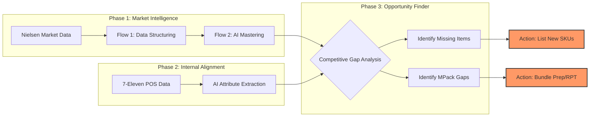

# Executive Summary: FMCG Growth Intelligence System

**Objective**: To maximize 7-Eleven Malaysia's revenue by identifying specific product and packaging gaps using AI-driven market analysis.

---

## 1. The High-Level Flow (How it Works)

---

## 2. Key Accomplishments (What we have built)

### 🧩 Stage 1: The Mastering Engine (Flow 1 & 2)
*   **The Problem**: Raw Nielsen data is messy, with inconsistent names and typos.
*   **The Solution**: We built an AI engine that "reads" every item name. It extracts the Brand, Flavor, and Size, then merges similar items into a single, clean "Master Record."
*   **Result**: 100% clean and structured market data.

### 🏪 Stage 2: 7-Eleven Data Enrichment
*   **The Problem**: Internal 7-Eleven descriptions (e.g., *Hup Seng Cream Cracker 300g*) lack structured fields for "Variant" or "Pack Size."
*   **The Solution**: AI automatically extracts these attributes, mapping out exactly what 7-Eleven currently carries.
*   **Result**: A searchable, standardized 7-Eleven inventory.

### 🎯 Stage 3: The "Opportunity Finder" (Gap Analysis)
*   **The Problem**: Finding out why competitors sell more biscuits is manually intensive.
*   **The Solution**: Our system automatically compares the **Market Successes** vs. **7-Eleven Inventory**.
*   **Result**: It highlights the specific items and multi-packs (e.g., `X12` bundles) that are selling fast in the market but are not on 7-Eleven's shelves.

---

## 3. Business Impact for 7-Eleven
1.  **Stop Guessing**: Data-driven proof of which products will succeed.
2.  **MPack Advantage**: Moving from selling single packs (`X1`) to bundles (`X12`) based on market trends to increase the average transaction value.
3.  **Speed to Market**: Rapidly identify and list top-selling competitor items.

---
> [!NOTE]
> This system is now fully functional at the backend level and ready to generate actionable reports for the Category Management team.
