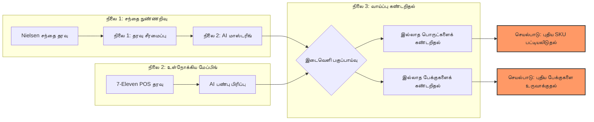

# செயல்முறை சுருக்கம்: FMCG வளர்ச்சி நுண்ணறிவு அமைப்பு (Executive Summary)

**நோக்கம்**: AI-திறன் கொண்ட சந்தை பகுப்பாய்வு மூலம் 7-Eleven மலேசியாவின் விற்பனையை அதிகரிப்பதற்கான வாய்ப்புகளைக் கண்டறிதல்.

---

## 1. செயல்பாட்டு வரைபடம் (How it Works)

---

## 2. இதுவரை முடித்துள்ள பணிகள் (Key Accomplishments)

### 🧩 நிலை 1: மாஸ்டரிங் என்ஜின் (Stage 1)
*   **சவால்**: Nielsen தரவுகளில் உள்ள பெயர்கள் குழப்பமாகவும், எழுத்துப் பிழைகளுடனும் இருக்கும்.
*   **தீர்வு**: நாம் உருவாக்கிய AI என்ஜின் ஒவ்வொரு தயாரிப்பு பெயரையும் "வாசித்து", அதன் பிராண்ட், சுவை மற்றும் அளவைத் துல்லியமாகப் பிரித்தெடுக்கிறது.
*   **விளைவு**: 100% சீரமைக்கப்பட்ட சந்தை தரவு.

### 🏪 நிலை 2: 7-Eleven தரவு செறிவூட்டல் (Stage 2)
*   **சவால்**: 7-Eleven-ன் உள்நாட்டுத் தரவுகளில் பிராண்ட் அல்லது சுவை போன்ற தகவல்கள் தனித்தனியாக இல்லை.
*   **தீர்வு**: AI மூலமாக 7-Eleven-ன் ஒவ்வொரு தயாரிப்பையும் பிரித்து, அதில் என்ன சுவை மற்றும் என்ன அளவு உள்ளது என்பதை வகைப்படுத்தினோம்.
*   **விளைவு**: தேடுவதற்கு எளிதான 7-Eleven சரக்கு பட்டியல்.

### 🎯 நிலை 3: வாய்ப்பு கண்டறிதல் (Opportunity Finder)
*   **சவால்**: மற்றவர்கள் ஏன் பிஸ்கட் விற்பனையில் முன்னிலையில் இருக்கிறார்கள் என்பதைத் தேடுவது கடினம்.
*   **தீர்வு**: நமது சிஸ்டம் தானாகவே **சந்தை வெற்றிகளையும்**, **7-Eleven இருப்பையும்** ஒப்பிடுகிறது.
*   **விளைவு**: சந்தையில் வேகமாக விற்பனையாகும், ஆனால் 7-Eleven-ல் இல்லாத குறிப்பிட்ட பேக்குகளை (உதாரணமாக: `X12` Bundles) இது அடையாளம் காட்டுகிறது.

---

## 3. 7-Eleven-க்கான பிசினஸ் லாபம்
1.  **ஊகங்கள் தேவை இல்லை**: எந்தப் பொருள் வெற்றியடையும் என்பதற்கான தரவு ஆதாரம்.
2.  **MPack பலம்**: வெறும் ஒற்றை பாக்கெட்டுகள் (`X1`) மட்டும் விற்காமல், சந்தை நிலவரப்படி பெரிய பேக்குகளை (`X12`) விற்று லாபத்தை அதிகரித்தல்.
3.  **வேகமான சந்தை அணுகல்**: சந்தையில் ஓடும் சிறந்த பொருட்களை உடனடியாக 7-Eleven-ல் பட்டியலிடுதல்.

---
> [!NOTE]
>Category Management குழுவிடம் நேரடியாக அறிக்கைகளை (Reports) வழங்க இந்த சிஸ்டம் இப்போது முழுமையாகத் தயாராக உள்ளது.
